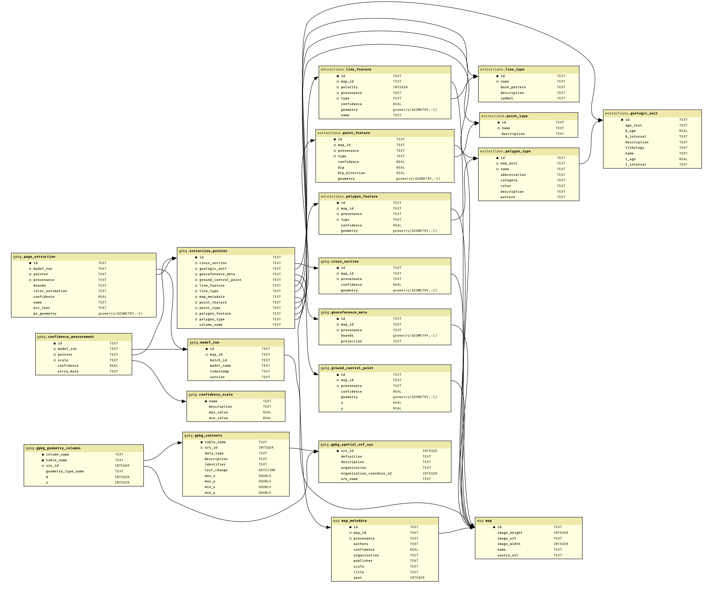

# TA1 GeoPackage format

This is a starting point for a GeoPackage format for TA1. It is based on the
[TA1 output schemas](https://github.com/DARPA-CRITICALMAAS/schemas/tree/main/ta10).
The initial version was created on 2023-12-14 by Daven Quinn (Macrostrat).
It will be maintained jointly by TA1 and TA4 as the schema is updated.

Better tests, example datasets, and loaders are coming soon. The package will then
be made available as `criticalmass.ta1_geopackage` on PyPI.

## Resources

- [GeoPackage](https://www.geopackage.org/)
- [OGC GeoPackage spec](https://www.geopackage.org/spec120/)
- [Switch from Shapefile](http://switchfromshapefile.org/)

## Prior art

- [Fudgeo](https://github.com/realiii/fudgeo): modern Python package for working with GeoPackages. Duplicates many features of more common
  packages like `fiona` and `geopandas` but provides low-level access to the GeoPackage spec.
- [GeoPackage Python](

## Differences from TA1 schema

- `extraction_identifier` -> `extraction_pointer`
- `model` field has been renamed to `pointer` for clarity for linking models
- `MapFeatureExtractions` is replaced by many-to-one foreign key relationships
